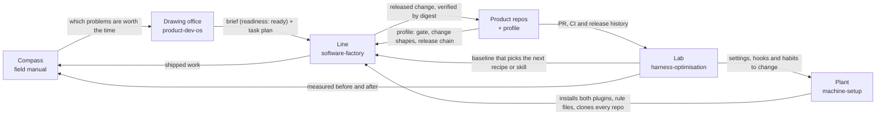

# The system

Five repositories, read as one factory for building digital products. This repo is the production
line. This file is the floor plan: what each department answers, what passes between them, and the
rules they share. It holds structure only; what is in flight right now is state, and lives elsewhere
(`conventions.md` §6).

## Five departments

| Department | Repo | Answers | Visibility |
|---|---|---|---|
| **Compass** | `personal-field-manual` | What am I getting good at, and where is the dated proof? | private |
| **Drawing office** | [`product-dev-os`](https://github.com/vladamon/product-dev-os) | What to build, and whether to. | public, plugin `product` |
| **Line** | `software-factory` (this repo) | How a shaped change is built, proven, landed and released. | public, plugin `factory` |
| **Lab** | `harness-optimisation` | How well the agent harness and the line run, by the numbers. | private |
| **Plant** | `machine-setup`, with a private memory store | Any machine becomes the working machine in one command. | private |

The product repos sit at the end of the line. Each carries a **profile** (its `CLAUDE.md`, headings from
`templates/profile.md`), which is the factory applied to that one repo.

No department answers another's question. When a change doesn't fit one of the five questions, it
probably belongs in a product repo's profile or in memory.

## What passes between them

| From | To | What passes | Where it is written down |
|---|---|---|---|
| Compass | Drawing office | Which problems are worth the time | The manual's plan |
| Drawing office | Line | A shaped brief with `readiness: ready`, and its task plan | `product:build`, `product:plan`; station 01 here |
| Line | Product repos | A released change, verified on the running workloads | Recipe 08 |
| Product repos | Line | The profile: gate command, change shapes, release chain | `templates/profile.md` |
| Product repos | Lab | Transcripts, PR timings, CI runs, release distance | `scripts/line-audit.py`, the lab's scripts |
| Lab | Line | A dated baseline; a recipe change is justified by the number it moves | `line.md`, *Measures* |
| Lab | Plant | A setting, hook or habit to change, each backed by an audit | The lab's recipes |
| Plant | Everything | Both plugins enabled, rule files linked, every repo cloned at the same path, memory synced | The plant's installer |
| Line, Lab | Compass | Evidence: shipped work, and measured before-and-after | The manual's competency map |

## One grammar

The same few rules repeat in every department, and that repetition is what makes five repos one system.
Anyone who learns them in one repo can read the other four.

| Rule | Compass | Drawing office | Line | Lab | Plant |
|---|:-:|:-:|:-:|:-:|:-:|
| **Recipes are the authority.** Process lives in `recipes/`; improve the recipe, not the runner. | ● | ● | ● | ● | docs |
| **Skills are thin runners** over a recipe, shipped as a plugin. | | ● | ● | | installs |
| **Gates refuse.** A missing input stops the run and names the fix. | rules | ● | ● | | doctor |
| **Earned lines only.** A rule exists because something went wrong once, and goes when it stops applying. | ● | gates | ● | ● | ● |
| **Dated, never rewritten.** A later decision supersedes by linking back. | ● | ● | traps | ● | |
| **Evidence over claims.** A number, a link or a digest. | ● | ● | ● | ● | doctor |
| **Generic here, local there.** Procedure in the repo, instance detail in a profile or a private file. | | ● | ● | ● | ● |
| **Humans authorise what leaves the room** (`authority.md`). | ● | ● | ● | ● | loads it |

The plant loads `authority.md` into every session on the machine, so the three tiers apply in every
repo, not only on the line.

## One loop, end to end

The departments connected, in the order it happened over two days in September 2026:

1. **Harvest (line).** 96 rules from one product team's rule files were sorted: 75 generic procedure
   became the nine recipes, 15 stayed in that repo's profile, the rest went to the harness or the
   design system.
2. **Measure (lab).** `line-audit.py` read 30 days of five repos. Opened to merged took one to two hours
   everywhere; merged to released took days. The baseline was filed as a dated audit.
3. **Decide by the number (line).** The longest wait sat between merge and release, so the first skill
   is `factory:release`, over recipe 08.
4. **Localise (product repo).** The profile gained its *Release chain* section. The skill refuses to
   run without it.
5. **Install (plant).** The plant registers the `factory` plugin next to `product`; the next install on
   any machine brings both.
6. **Ratchet (line and lab).** What went wrong on the way went back in as recipe traps and script guards: a CI
   watcher that exited too early, a stack that conflicted with its own squashed base, a rebuilt tag with a new
   digest, an audit that spent the account's API budget.
7. **Record (compass).** A baseline, a change and a re-measure are the evidence the manual asks for.

## Where to start

| Situation | Door |
|---|---|
| A new machine | The plant's installer |
| An idea, or a doubt about one | `product:next "…"` |
| A shaped change to build | Recipes 01 → 09 here |
| Merged work users can't see yet | `/factory:release status` |
| Something about the setup feels slow | An audit in the lab, before any change |
| A month has passed | The compass's plan |
